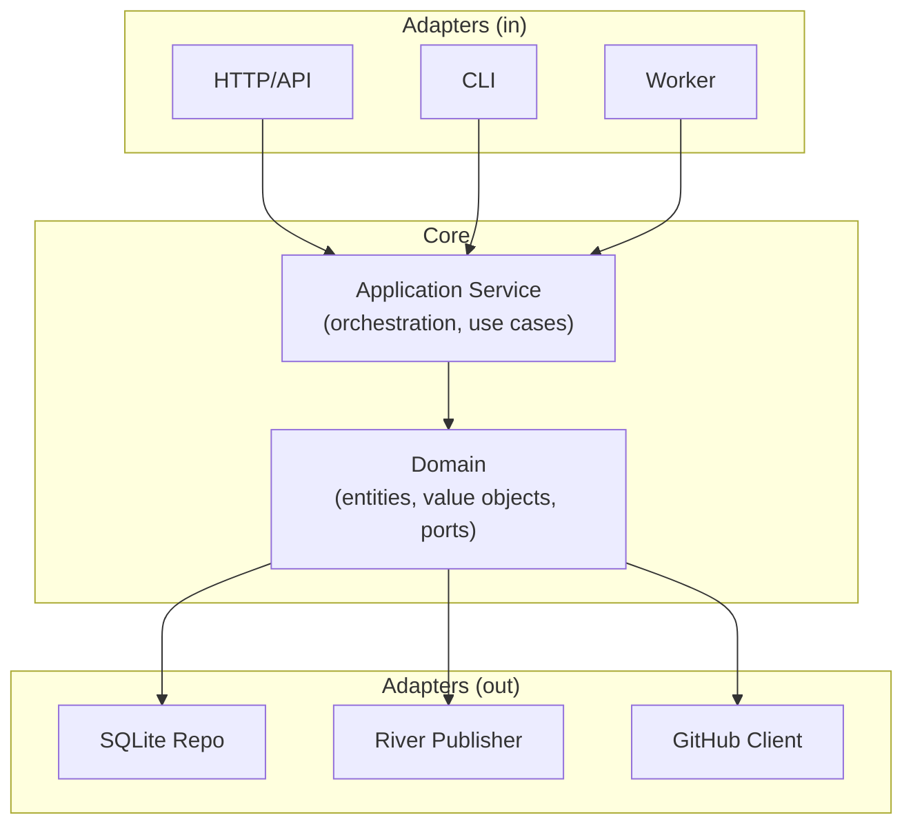
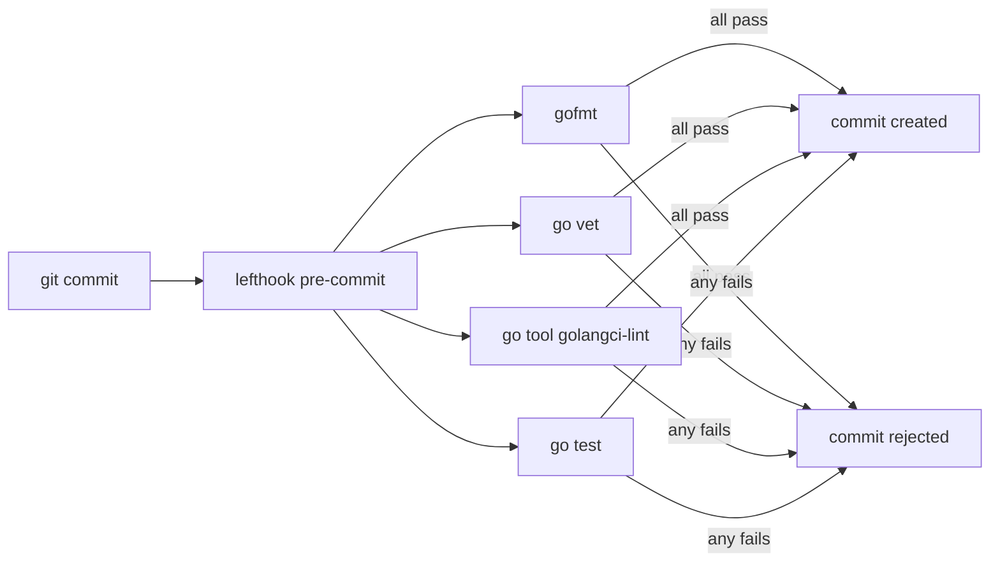

# Development Guide

This document captures the architecture, design decisions, and conventions of tenantiq. It serves as a guide for contributors and as a record of *why* things are built the way they are.

## Tech Stack

| Component | Technology | Why |
|-----------|-----------|-----|
| Language | Go | Single binary, strong typing, excellent concurrency |
| HTTP Router | Chi + Huma | Chi for routing, Huma for automatic OpenAPI generation and Scalar UI |
| Database | SQLite | Zero-dependency, embedded, sufficient for single-node deployments |
| Migrations | goose | SQL-based migrations, no code generation required |
| State Machine | looplab/fsm | Declarative FSM with callbacks, well-maintained |
| Task Queue | river | Async job processing backed by SQLite |
| Observability | OpenTelemetry | Vendor-neutral traces, metrics, and logs |
| Frontend | React (embedded) | Compiled and embedded into the binary via `go:embed` |
| Auth | GitHub App | OAuth flow for GitHub-based authentication |

## Architecture

tenantiq follows **hexagonal architecture** (ports & adapters). The goal is to keep business logic independent of infrastructure.



### Layer Rules

1. **Domain** (`internal/domain/`) — Pure business logic. No imports outside the standard library. Defines entities, value objects, and ports (interfaces).
2. **Application** (`internal/app/`) — Use-case orchestration. Depends only on domain. Coordinates ports without knowing their implementations.
3. **Adapters** (`internal/adapter/`) — Concrete implementations of ports. Each adapter depends on its external library (SQLite driver, Chi, etc.) and on the domain interfaces.

**The dependency rule**: dependencies always point inward. Adapters depend on the domain, never the reverse.

## Project Structure

```
tenantiq/
├── cmd/
│   └── tenantiq/          # Binary entrypoint
│       └── main.go
├── internal/
│   ├── domain/            # Core business logic
│   │   ├── tenant.go      # Tenant entity, states, events, transitions
│   │   ├── ports.go       # Repository and EventPublisher interfaces
│   │   ├── errors.go      # Domain-specific error types
│   │   └── tenant_test.go
│   ├── app/               # Application services
│   │   ├── service.go     # TenantService (orchestration)
│   │   ├── id.go          # ID generation strategy
│   │   └── service_test.go
│   └── adapter/           # Infrastructure implementations
│       ├── sqlite/        # TenantRepository (SQLite)
│       ├── http/          # REST API handlers
│       ├── river/         # EventPublisher (async queue)
│       └── otel/          # OpenTelemetry setup
├── migrations/            # SQL migrations (goose)
├── web/                   # React frontend source
├── go.mod
├── README.md
└── DEVELOPMENT.md
```

## Getting Started

```bash
# Clone and setup
git clone https://github.com/NeoMorfeo/tenantiq.git
cd tenantiq
make setup    # Installs lefthook hooks + downloads tool dependencies
```

After `make setup`, every `git commit` automatically runs:

| Check | What it does |
|-------|-------------|
| `gofmt` | Verifies Go code formatting |
| `go vet` | Catches suspicious constructs |
| `golangci-lint` | Runs 15+ linters via `go tool` (no global install needed) |
| `go test` | Runs the full test suite |

If any check fails, the commit is rejected. Fix the issue and try again.

### Tool Management

Dev tools are managed through Go's native `tool` directive in `go.mod` — no global installs required (similar to `uv tool` in Python). The only external tool is `lefthook`, which `make setup` installs automatically via `go install`.



## Design Decisions

### 1. Status and Event as typed strings, not iota

```go
type Status string
const StatusActive Status = "active"
```

**Why not `iota`?** With `iota`, values are integers (`0, 1, 2...`). If someone reorders the constants, stored values in SQLite break silently. With strings, `"active"` is always `"active"` — in the database, in JSON responses, and in logs.

### 2. Transitions as data, not code

```go
var Transitions = []Transition{
    {Event: EventSuspend, Src: StatusActive, Dst: StatusSuspended},
    // ...
}
```

The domain defines *what* transitions are valid as a data structure. The FSM library (an adapter) consumes this data to enforce the rules. This keeps the domain free of `looplab/fsm` imports and makes the transitions trivially testable.

### 3. Tenant as a value type

`NewTenant()` returns `Tenant`, not `*Tenant`. Value types in Go:
- Cannot be nil (no nil pointer panics)
- Are copied on assignment (no accidental mutation)
- Are cheaper for small structs (no heap allocation)

### 4. No physical delete

There is no `Delete` method on `TenantRepository`. Tenants are never removed from the database. Instead, they transition to the `deleted` state via the FSM. This provides:
- Audit trail (you can see when and how a tenant was deleted)
- Recovery capability (a future `restore` event could be added)
- Referential integrity (no dangling foreign keys)

### 5. Interfaces at the domain boundary

The domain defines two ports:

```go
type TenantRepository interface { ... }
type EventPublisher interface { ... }
```

These are intentionally minimal — only the methods the domain needs. The SQLite adapter may have additional methods (e.g., `RunMigrations`), but those don't leak into the domain interface.

### 6. Error types for structured error handling

Three categories of errors, each with a different pattern:

| Error | Pattern | HTTP Status | Why |
|-------|---------|-------------|-----|
| `ErrTenantNotFound` | Sentinel (`errors.Is`) | 404 | Simple condition, no extra data needed |
| `SlugConflictError` | Type (`errors.As`) | 409 | Carries the conflicting slug for the error message |
| `TransitionError` | Type (`errors.As`) | 422 | Carries the event and current state for debugging |

Each adapter translates domain errors to its own vocabulary (HTTP status codes, log messages, etc.).

### 7. Single Transition method instead of per-event methods

```go
func (s *TenantService) Transition(ctx context.Context, id string, event Event) (Tenant, error)
```

Instead of `Suspend()`, `Reactivate()`, `Delete()`, etc. The valid transitions are already defined in `domain.Transitions`. One method handles all events, reducing code duplication and making it trivial to add new events.

### 8. ID generation isolated

ID generation lives in `internal/app/id.go`, not in the domain or in an adapter. This makes it easy to switch strategies (UUID v4 → UUID v7 → ULID) without touching business logic.

### 9. Manual mocks over frameworks

Test mocks are simple structs implementing the port interfaces (~40 lines). No `gomock`, `testify/mock`, or code generation. This is possible because the interfaces are small (2-5 methods each). If interfaces grow beyond 5-7 methods, that's a signal to split them.

## Conventions

### Go

- `context.Context` is always the first parameter of any function that performs I/O or may be long-running
- Errors are wrapped with `fmt.Errorf("doing thing: %w", err)` to build a trace
- Time is always `time.Now().UTC()` — never local time
- Package names are single lowercase words: `domain`, `app`, `sqlite`, not `tenantDomain`

### Testing

- Domain tests are pure — no mocks, no I/O
- Application tests use manual mocks of domain interfaces
- Adapter tests use real infrastructure (SQLite in-memory, etc.)
- Test functions follow `Test<Method>_<Scenario>` naming

### Makefile

All project operations are driven through the Makefile. Run `make help` to see available targets.

```bash
make setup    # Install dev tools and git hooks (run once after clone)
make          # Run fmt + vet + lint + test + build (full pipeline)
make test     # Run tests with coverage report
make cover    # Run tests and open HTML coverage report in browser
make build    # Build the binary to ./bin/
make lint     # Run golangci-lint
make dev      # Run in development mode
make clean    # Remove build artifacts
```

Coverage reports are generated in `./coverage/` and should not be committed (add to `.gitignore`).

### Git

- Conventional commits: `feat:`, `fix:`, `refactor:`, `docs:`, `test:`
- One logical change per commit
