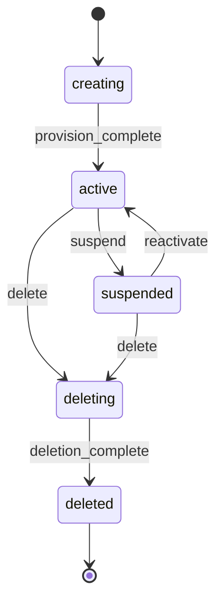

# tenantiq

Tenant lifecycle management service. A single Go binary with zero external dependencies that handles the complete lifecycle of tenants in a multi-tenant platform — from creation and provisioning to suspension and deletion.

## Features

- **Single binary** — No external databases, message brokers, or services required
- **REST API** with automatic OpenAPI documentation and Scalar UI
- **Tenant lifecycle FSM** — State machine governing tenant states (`creating` → `active` → `suspended` → `deleting` → `deleted`)
- **Async task queue** — Background jobs for provisioning, cleanup, and notifications
- **Observability** — OpenTelemetry traces, metrics, and logs from day one
- **Embedded UI** — React frontend compiled into the binary via Go embed
- **GitHub App auth** — Authenticate via GitHub App for seamless integration

## Tenant Lifecycle

Tenants follow a strict state machine:



### States

| State | Description |
|-------|-------------|
| `creating` | Initial state. Tenant is being provisioned. |
| `active` | Tenant is fully operational. |
| `suspended` | Tenant is temporarily disabled. Can be reactivated. |
| `deleting` | Tenant resources are being cleaned up. |
| `deleted` | Terminal state. Tenant is soft-deleted. |

### Events

| Event | From | To | Description |
|-------|------|----|-------------|
| `provision_complete` | `creating` | `active` | Infrastructure provisioning finished |
| `suspend` | `active` | `suspended` | Tenant suspended (billing, abuse, etc.) |
| `reactivate` | `suspended` | `active` | Tenant restored to active |
| `delete` | `active`, `suspended` | `deleting` | Tenant deletion initiated |
| `deletion_complete` | `deleting` | `deleted` | All resources cleaned up |

## Quick Start

```bash
# Build
go build -o tenantiq ./cmd/tenantiq

# Run
./tenantiq

# The API will be available at http://localhost:8080
# OpenAPI docs at http://localhost:8080/docs
```

## API Overview

```
POST   /api/v1/tenants              Create a new tenant
GET    /api/v1/tenants              List tenants
GET    /api/v1/tenants/{id}         Get tenant by ID
POST   /api/v1/tenants/{id}/events  Trigger a lifecycle event
```

## Configuration

tenantiq uses environment variables for configuration:

| Variable | Default | Description |
|----------|---------|-------------|
| `PORT` | `8080` | HTTP server port |
| `DATABASE_PATH` | `tenantiq.db` | SQLite database file path |
| `LOG_LEVEL` | `info` | Log level (`debug`, `info`, `warn`, `error`) |

## License

MIT
